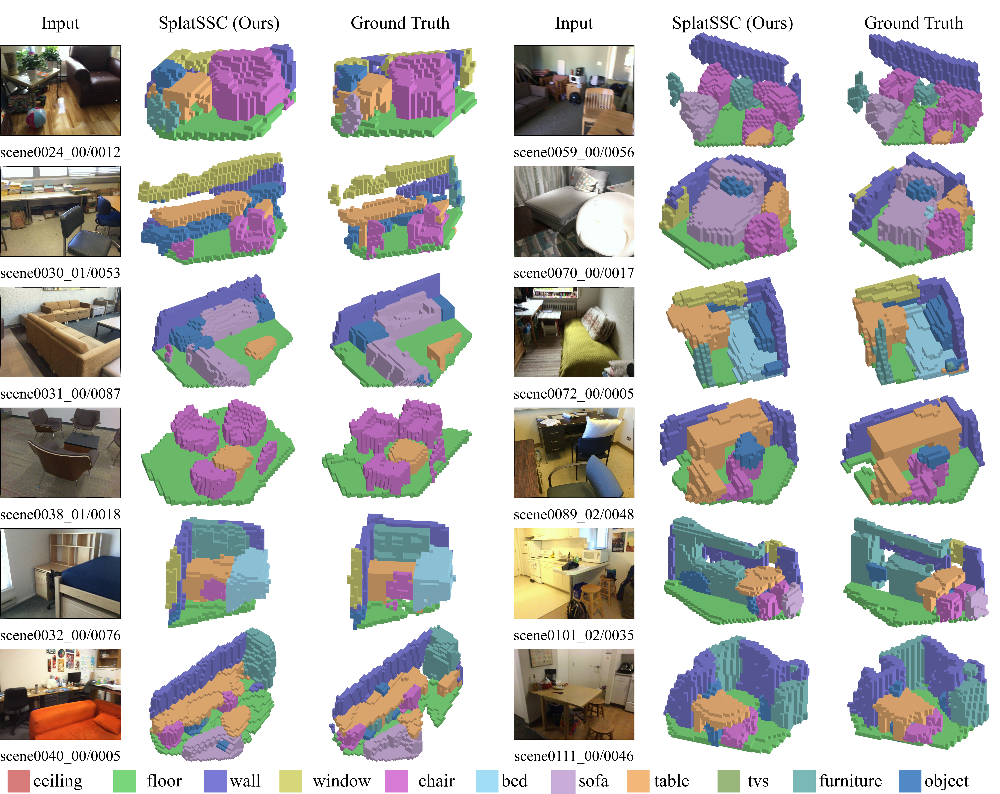
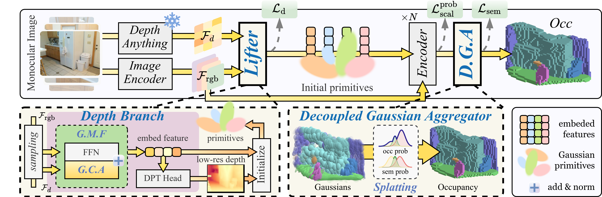

# SplatSSC: Decoupled Depth-Guided Gaussian Splatting for Semantic Scene Completion

[Rui Qian](https://scholar.google.com/citations?user=ezQHNKwAAAAJ&hl=en), [Haozhi Cao](https://scholar.google.com/citations?user=EaRJECUAAAAJ&hl=en), [Tianchen Deng](https://github.com/dtc111111), [Shenghai Yuan](https://scholar.google.com/citations?user=XcV_sesAAAAJ&hl=en), [Lihua Xie](https://scholar.google.com/citations?user=Fmrv3J8AAAAJ&hl=en) 

## News
- **2025.12.13**: Checkpoints and training information for depth branch and SplatSSC on Occ-ScanNet dataset are released! 
- **2025.11.08**: 🎉 Accepted to **AAAI** 2026 as **oral** presentation!  Stay tuned for more updates!
- **2025.08.04**: [SplatSSC](https://arxiv.org/abs/2508.02261) is avaliable on arixv.

SplatSSC formulates **a monocular 3D occupancy prediction task** and proposes a Gaussian-based framework to accomplish it.



## Overview

Monocular 3D Semantic Scene Completion (SSC) is a challenging yet promising task that aims to infer dense geometric and semantic descriptions of a scene from a single image. While recent object-centric paradigms significantly improve efficiency by leveraging flexible 3D Gaussian primitives, they still rely heavily on a large number of randomly initialized primitives, which inevitably leads to 1) inefficient primitive initialization and 2) outlier primitives that introduce erroneous artifacts. In this paper, we propose SplatSSC, a novel framework that resolves these limitations with a depth-guided initialization strategy and a principled Gaussian aggregator. Instead of random initialization, SplatSSC utilizes a dedicated depth branch composed of a Group-wise Multi-scale Fusion (GMF) module, which integrates multi-scale image and depth features to generate a sparse yet representative set of initial Gaussian primitives. To mitigate noise from outlier primitives, we develop the Decoupled Gaussian Aggregator (DGA), which enhances robustness by decomposing geometric and semantic predictions during the Gaussian-to-voxel splatting process. Complemented with a specialized Probability Scale Loss, our method achieves state-of-the-art performance on the Occ-ScanNet dataset, outperforming prior approaches by over $6.3\%$ in IoU and $4.1\%$ in mIoU, while reducing both latency and memory consumption by more than $9.3\%$.



## 🚀 Getting Started

### Installation
1. Local Environment: Follow instructions [HERE](docs/local_install.md) to prepare the local environment.
2. Docker Environment: Follow instructions [HERE](docs/docker_install.md) to prepare the docker environment.

### Data Preparation
Prepare **posed_images** and **gathered_data** following the [Occ-ScanNet dataset](https://huggingface.co/datasets/hongxiaoy/OccScanNet) and move them to **data/occscannet**. The folder structure should look like this: 

```bash
SplatSSC
├── results/
│   ├── occscannet/
│   │   ├── ...
├── vis/
│   ├── occscannet/
│   │   ├── ...
├── data/
│   ├── occscannet/
│   │   ├── gathered_data/
│   │   ├── posed_images/
│   │   ├── train_final.txt
│   │   ├── train_mini_final.txt
│   │   ├── test_final.txt
│   │   ├── test_mini_final.txt
```

### Model Zoo

| Dataset          | Depth Model | Stage | Epoch |  IoU  | mIoU  |                            Config                            |                             Log                              |                            Weight                            |
| ---------------- | ----------- | :---: | :---: | :---: | :---: | :----------------------------------------------------------: | :----------------------------------------------------------: | :----------------------------------------------------------: |
| Occ-ScanNet      | DaV2        |   1   |  10   |   -   |   -   |                              -                               |                              -                               | [weight](https://entuedu-my.sharepoint.com/:u:/g/personal/rqian003_e_ntu_edu_sg/IQDn7GWqp3uLQpebJNvH7kFhAaI7YpbK2xxgrxQTFzTWNKM?e=b0NSA0) |
| Occ-ScanNet      | FT-DaV2     |   1   |  10   |   -   |   -   |                              -                               |                              -                               | [weight](https://entuedu-my.sharepoint.com/:u:/g/personal/rqian003_e_ntu_edu_sg/IQD7gbYlx2ygSKeV10wXTmG3AY9RUgEOYnT60S0xgWzM4BM?e=7AboVH) |
| Occ-ScanNet      | FT-DaV2     |   2   |  10   | 62.83 | 51.83 | [config](https://entuedu-my.sharepoint.com/:u:/g/personal/rqian003_e_ntu_edu_sg/IQCp7gaQimbfR4_OfVa9t5JkAfwLwbB0IdoyYSSTws1sPrg?e=CxYMvH) | [log](https://entuedu-my.sharepoint.com/:u:/g/personal/rqian003_e_ntu_edu_sg/IQAS_IuaR4UrSqN55Tvq6HJwAeh0saERvzs_eexf7DV-fFk?e=fIEm8G) | [weight](https://entuedu-my.sharepoint.com/:u:/g/personal/rqian003_e_ntu_edu_sg/IQDNm_4TQDz8TYrcvG0lXIQIAW2NCaCZysqpCuNCZcVEDoI?e=p53wSB) |
| Occ-ScanNet-mini | FT-DaV2     |   2   |  20   | 61.47 | 48.87 | [config](https://entuedu-my.sharepoint.com/:u:/g/personal/rqian003_e_ntu_edu_sg/IQDVSYmSmegVT5yk4OhkegwhAfTFBW7g_tiX_27v8yidHxg?e=SFhTee) | [log](https://entuedu-my.sharepoint.com/:u:/g/personal/rqian003_e_ntu_edu_sg/IQAowcr5NGs7R5h4bosG_uH5Abj3vrhIMs0uc9s5cGZKtcc?e=uHB6AW) | [weight](https://entuedu-my.sharepoint.com/:u:/g/personal/rqian003_e_ntu_edu_sg/IQDJGs3W29wATIFltsrchkKnATqTMkGgjHP106QJa0FunoM?e=tu239x) |

## 🐣 Train 

1. Pre-train our depth branch using 2 GPUs on Occ-ScanNet:
    ```bash
    cd SplatSSC 
    bash scripts/fine_tune_mono.sh 
    ```
2. Train SplatSSC using 4 GPUs on Occ-ScanNet and Occ-ScanNet-mini:
    ```bash
    cd SplatSSC
    # mini 
    bash scripts/train_mono_mini.sh  
    # base 
    bash scripts/train_mono.sh  
    ```

## 🧸 Test

1. Test our depth branch using 1 GPU on Occ-ScanNet:

   ```bash
   cd SplatSSC
   bash scripts/test_fine_tuned_mono.sh   
   ```

2. Test SplatSSC using 1 GPU on Occ-ScanNet and Occ-ScanNet-mini:

   ```bash
   cd SplatSSC
   # mini 
   bash scripts/test_mono_mini.sh  
   # base 
   bash scripts/test_mono.sh  
   ```

## 👀 Visualization 
`Still under processing ...`

## 🤝 Related Projects 

1. Our work is inspired by these excellent open-sourced repos:
[EmbodiedOcc](https://github.com/ykiwu/embodiedocc), [GaussianFormer](https://github.com/huang-yh/GaussianFormer), [ISO](https://github.com/hongxiaoy/ISO).

2. Our code is based on [EmbodiedOcc](https://github.com/ykiwu/embodiedocc) and [GaussianFormer](https://github.com/huang-yh/GaussianFormer).

## ⚖️ License 
All our original source code is licensed under the [CC-BY-NC-SA-4.](https://creativecommons.org/licenses/by-nc-sa/4.0/) license. This permits any non-commercial use, distribution, and reproduction in any medium, provided the original work is properly cited and any derivative works are shared under the same license.

## 🧾 Citation
If you find this project helpful, please consider citing the following paper:
```
@article{qian2025splatssc,
  title={SplatSSC: Decoupled Depth-Guided Gaussian Splatting for Semantic Scene Completion},
  author={Qian, Rui and Cao, Haozhi and Deng, Tianchen and Yuan, Shenghai and Xie, Lihua},
  journal={arXiv preprint arXiv:2508.02261},
  year={2025}
}
```
